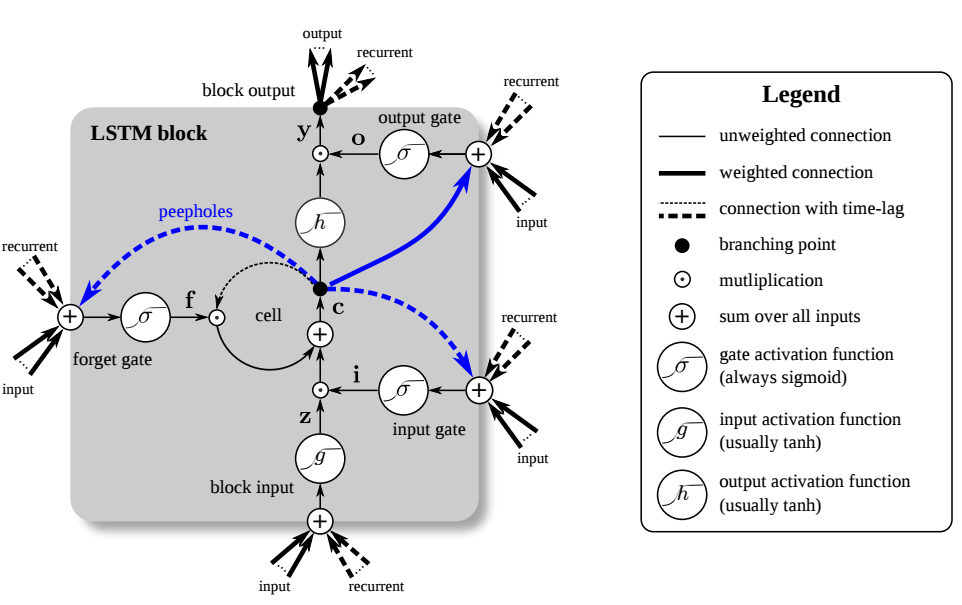

# Organization : UPMC - Machine Learning and Artificial Intelligence Lab

### People : Pandav2 aka David Panou | Youcef Benyettou

## This repository provide several in depth tutorials of going through the following subjects

1. Simple Neural Network with Gradient Descent training and Introduction to LUA
2. Mini-batch, train/test Criterion implementation
3. To be announced

---

---
### Contacts
For any question regarding this page : david [d o t] panou [a t] gmail [d o t] com